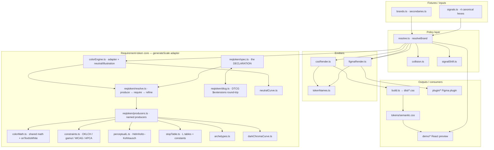

# OKChroma — System documentation

> Status: written 2026-06-29 from a skeptical, code-first read of the `docs-rewrite`
> branch. The **code is the source of truth**; where older comments or docs disagreed,
> the code won. File references are `path:line` against this branch.

## 1. System Overview

**OKChroma is a color-system engine.** You give it one brand color (a hex). It generates a
complete, theme-ready color system around that color: a light and dark ramp built from
pre-reserved roles — 2 papers, 5 washes, 2 highlights, and 2 inks — plus a solid
call-to-action fill and hover, their on-text colors, a brand-tinted neutral ramp, and
four status ramps (error / warning / success / info) — each guaranteed legible and kept
visually distinct from the others.

The core promise is **white-label predictability**: every brand's "step 9" lands at the
same *perceived* lightness and plays the same role, so you define your design tokens
against step **numbers** once (solid fill = step 9, body text = step 11, default border =
step 6) and they hold for *any* brand color, with no per-brand re-tuning. Accessibility
(WCAG contrast targets, plus APCA for emphasis fills) is built into the math rather than
checked afterward.

**Who it serves:** designers and design-engineers who need to turn an arbitrary brand
color into a coherent, accessible token set — and ship it into their own product or
design library.

**What it produces** (two interchangeable outputs carrying identical values):

- **CSS custom properties** — `dist/brands.css` (one block per brand, light + dark) +
  `dist/signals.css`, consumed through the hand-written semantic layer
  `tokens/semantic.css`.
- **Figma variables** — written directly into a Figma file by the plugin (a `mode`
  primitive collection + a `theme` alias collection).

The **demo** (a live React app) and the **Figma plugin** are both front-ends that call the
same engine. The engine and its output *are* the product; the demo is a preview.

> Design lineage: the "reserved role per step" scale model is a nod to
> [Radix Colors](https://www.radix-ui.com/colors/docs/palette-composition/understanding-the-scale)
> as a conceptual inspiration. It is **not** a dependency and does not touch the math —
> all color computation is original.

---

## 2. Core Architecture

### The story in one paragraph

One hex enters `resolveBrand`. That function calls `generateScale`, which is now a thin
adapter over the **requirement-token core** (`src/reqtoken/`): a pure-data **declaration**
(`spec.ts` — per-stop producers, requirements, and roles) executed by a **resolver**
(`resolve.ts` + `producers.ts`) in three phases per stop — **produce** (hue → chroma →
lightness), **require** (declared floors: contrast, seam separation), **refine** (chroma
yields to gamut). `resolveBrand` then layers **policy** on top — checking the result
against the four status colors and, on a collision, re-running the engine with different
settings or recording a flag. The resolved result is handed to an **emitter** (CSS or
Figma) that maps the computed color stops onto named tokens and chooses light vs dark.
`build.ts` drives this in a loop over the brand fixtures to write the CSS files; the demo
and plugin drive the exact same functions live.

### 2a. Architecture details

Recommended documentation format: three coordinated, in-repo artifacts — **(A)** a Mermaid
layer/flow graph (renders on GitHub, diffs cleanly, stays editable — preferable to an
exported image), **(B)** a linear pipeline-stage table, **(C)** an output-vocabulary
table. All three follow.

#### (A) Module map



#### (B) Pipeline stages

| # | Stage | File · function | In → Out |
|---|-------|-----------------|----------|
| 1 | Decode + context | `producers.ts` · `buildContext` | hex + opts → OKLCH seed, archetype, and the aesthetic state (chroma boost, mutedness, cream gate, warm-drift caps, red-cool weights) |
| 2 | Compile | `colorEngine.ts` · `generateScale` (adapter) | caller opts + the built-in declaration → a per-mode `ModeSpec` for the resolver (e.g. the `highlight` flag gates stop 9 out) |
| 3 | Resolve stops | `resolve.ts` · `resolveRamp` | per declared stop: **produce** (hue → chroma → `perceptualRungL`) → **require** (declared floors bind: contrast down-clamp in light, raise-off-paper in dark, seam separation) → **refine** (chroma yields to gamut). Stops resolve in order, so a require can reference an already-resolved stop |
| 4 | Resolve roles + ons | `resolve.ts` | off-scale `cta`/`cta-hover` roles (anchor = the brand's own lightness, floored in dark; the on-fill enforce re-solve last); `on-cta`/`on-highlight` poles chosen by the declared `ons` rules — never feeding back into a fill |
| 5 | Assemble | `colorEngine.ts` adapter | resolved ramps → the same `GeneratedScale` contract as always (light[], dark[], cta×4, on-booleans) |
| 6 | **Policy** | `resolve.ts` (engine) · `resolveBrand` | runs collisions; may re-call the engine with new archetype/options; computes signal overrides |
| 7 | Emit | `cssRender.ts` / `figmaRender.ts` + `tokenNames.ts` | `GeneratedScale` → named CSS vars or Figma variable tree |
| 8 | Drive | `build.ts` (batch) / demo / plugin (live) | writes `dist/*.css` / renders preview / writes Figma |

Structural facts worth stating plainly:

- The public API is unchanged: `resolveBrand` (policy entry) and `generateScale` (engine
  entry, same signature and options as before the requirement-token rework — consumers,
  the plugin included, never see the internal change).
- The engine runs **~6× per brand** (brand, secondary, neutral, and the cached signal
  scales). The four **signal scales are generated once at module load** (`SIGNAL_SCALES`,
  `resolve.ts:15`) and reused everywhere.
- **Light/dark is computed together, chosen at render.** Both ramps resolve from their
  declared `ModeSpec` and land on one `GeneratedScale`. `brandKindBody(prefix, scale, mode)`
  (`cssRender.ts:26`) picks `scale.light` vs `scale.dark` per mode; CSS emits a
  `[data-brand]` block (light) and a `[data-brand][data-theme="dark"]` block (dark).
- **`highlight-9` is an ordinary scale stop; `cta-1/2` are the only off-scale tokens** —
  in the declaration they are literally different kinds: stops carry numbers, the cta is a
  named **role** with no number, so the historical stop-9/cta confusion cannot recur.

The data structures that flow through everything:

```ts
// the declaration (pure data — src/reqtoken/spec.ts)
ModeSpec       = { stops: StopReq[], roles: RoleReq[], ons: { onFill, onHighlight } }
StopReq        = { stop, rootL, group, produce: {hue, L, chroma}, satFraction?/baseC?/chromaMult?, require? }
RoleReq        = { role: 'cta'|'cta-hover', produce, floorL, chromaMult }

// the resolved output (unchanged public contract)
ColorStop      = { stop, L, C, H, r, g, b }
GeneratedScale = { name, archetype, brandL/C/H,
                   onFillTextIsWhite(+Dark), light[], dark[],
                   cta, ctaHover, ctaDark, ctaHoverDark,
                   onHighlightIsWhite(+Dark)?, identityHex? }
ResolvedBrand  = { scale, shearDeg, redRepel: {light,dark}|null,
                   warningVariant, pending[], signalOverrides[] }
```

#### (C) Output token vocabulary (`tokenNames.ts`)

| Stops | Token names | Role |
|---|---|---|
| 1–2 | `paper-1`, `paper-2` | surfaces / backgrounds |
| 3–7 | `wash-3` … `wash-7` | low-hierarchy fills, borders, decorative |
| 8 | `highlight-8` | WCAG 1.4.11 **3:1** non-text step (borders, UI elements) |
| 9 | `highlight-9` | emphasis fill — a **scale stop**, same machinery as the rest (stop 10 deleted 2026-07-09) |
| 10–11 | `ink-10`, `ink-11` | text (4.5:1 / 7:1) |
| off-scale | `cta-1`, `cta-2` | the **only** off-scale tokens: the pulled-out solid button fill + hover |
| computed | `on-cta`, `on-highlight` | black/white text for those fills |
| literal | `identity` | the exact input hex (brand / secondary only) |

`tokens/semantic.css` is a **static, hand-authored alias layer** (never generated): it maps
human role names (`--surface-*`, `--fg-*`, `--border-*`, `--alert-high-*` → red,
`--alert-med-*` → yellow, `--positive-*` → green, `--info-*` → info-color, `--illus-*`)
onto the emitted primitives. Only the primitives change per brand.

### 2b. The requirement schema

> Field-by-field reference for the serialized token format — with real emitted JSON
> examples — lives in **[schema.md](schema.md)**. This section is the conceptual model.

The engine's core idea: **a token is a requirement the engine solves, not a frozen value.**
The declaration (`src/reqtoken/spec.ts`) is pure, serializable data; the resolver executes
it. Three phases per stop, in order:

- **produce** — the forward formula. Named producers, referenced by name in the data:
  `hue: 'warm-drift' | 'warm-torsion' | 'constant'`, `L: 'perceptual' | 'fixed'` (plus
  `'anchor'`/`'hover'` for roles), `chroma: 'ladder' | 'brand'`. The producer
  *implementations* (the Nayatani solve, the gold-spine drift, the chroma ladder/envelope
  blend, the aesthetic state) live in `producers.ts` under the resolver id
  `okchroma-reqtoken@2` — they are the house style *of this resolver*, not portable data.
- **require** — declared floors, checked and enforced against **resolved** stops (never a
  cached value, so a pushed stop automatically re-solves everything referencing it):
  - `{ metric: 'wcag', against: 'paper-2', target }` — `highlight-8` 3:1, `ink-10` 4.5,
    `ink-11` 7.0, declared in **both modes** (light clamps down; dark raises off the
    paper; a placement that already clears doesn't move).
  - `{ metric: 'min-separation', against: 'paper-1' | 'prev', target }` — OKLab ΔE seam
    floors: `paper-2` ≥ 0.028 off `paper-1`; every wash seam ≥ 0.012 off its predecessor
    (guards low-chroma seeds, where chroma contributes nothing to seam distance).
  - the `ons` block — `on-cta`/`on-highlight` pole choice (`apca-pole`, with the WCAG-4.5
    enforce fallback on `on-cta`). On-text is chosen on one criterion: it passes. It never
    feeds back into a fill.
  A require the resolver cannot meet yields an explicit `unresolvable` marker — never a
  silent fudge.
- **refine** — chroma yields to the sRGB gamut at emit.

**The spec/resolver line** (what's portable vs what isn't): stop identity, rootL ladders,
per-stop chroma params, producer *names*, and every requirement are data — they serialize
to DTCG tokens (`dtcg.ts`: frozen `$value` fallback for any DTCG tool + the live
requirement in `$extensions['org.okchroma.requirement']`, round-trip-proven by
`scripts/reqtoken-portability.ts` — editing a requirement in the token file changes the
re-resolved value). The producer implementations and their constants stay behind the
versioned resolver id: twenty aesthetic constants in a token file would be fake
portability.

**The gate:** `npm run req:audit` resolves an agnostic 24-hue × 3-chroma sweep in both
modes and verifies every *declared* requirement plus structural invariants (totality,
monotonic ladder, gamut, role floors, on-pole validity). Requirement-satisfaction is the
contract; the blessed snapshots remain the value-regression pin.

### 2c. Design decisions (the "design touches")

These are the deliberate adjustments layered onto a naive ramp, grouped by goal.

#### Aesthetics / brand fidelity

- **OKLCH throughout** (`constraints.ts`) — a perceptual space, so steps look evenly
  spaced and a ramp holds one hue from light to dark.
- **Warm-hue "gold spine" torsion** — `GOLD_SPINE` (a 6-point L→H table, `stopTable.ts`)
  + `WARM_TORSION` (band ≈ 40–122°, taper 10°, travel 0.55, cap ±24°). Warm brands rotate
  their hue toward gold as lightness changes, so **dark gold/orange stays gold instead of
  going olive or brown** (`torsionedHue`, `lightHueAt`, `goldSpineHue`). Applied to the
  light ramp, the dark rungs, and illustrations.
- **Red-brand cooling** — `RED_COOL_DEG = 10.8°` (`colorMath.ts`); `redCoolWeight`
  ramps in above H ≈ 12° and out above H ≈ 35.5° (`inRedBand`). Warm reds rotate a few
  degrees **cooler** so a brand red reads as *brand*, not error red. Applied in light
  (`lightHueAt`) and to the dark ramp (`coolRedDark`) — the CTA is exempt on both sides
  (C12 v8: cta red de-collision belongs to the joint solve alone; the old cta render pass
  `applyRedCoolRender`/`applyRedRepelRender` is deleted and the dark cta rides identity hue).
  It is **brand-only**: the red *signal* keeps its identity hue in both modes — signals pass
  `suppressRedCool: true` (the light-side analogue of brands' `coolRedDark`), so the cool
  never touches them.
- **Style lever** (`deeper` / `full-chroma`) — set per brand at intake (`brands.ts`); acts
  **only** inside the ambiguous semi-muted warm band (`deeper` → browner/deeper;
  `full-chroma` → stays loud). A no-op outside that band.
- **Chroma boost** near hue ≈ 90° (`chromaBoost`, `producers.ts`) for luminous warm
  hues that would otherwise read flat.

#### Accessibility

- **Helmholtz–Kohlrausch lightness solve** — at equal measured luminance, a saturated
  color *looks* brighter than gray, by a hue-dependent amount (large for blue/red/violet,
  small for yellow-green). `perceptualL.ts` implements the **Nayatani (1997)** model
  (`apparentL`); `perceptualRungL` solves the *measured* L at which each stop's *apparent*
  lightness matches a common target. → A high-boost hue (blue) is placed at a lower
  measured L, a low-boost hue (yellow-green) higher, so every step reads the same across
  brands. **The light ramp solves every stop. The dark ramp solves the paper/wash surfaces
  (1–7) and the ink text stops (10/11) the same way, but holds the highlight band (8–9) at
  its `DARK_L` placement — those stops are legibility/3:1-constrained (solving them would
  re-enter the APCA dead zone and ride a solved surface up past the placed band), so they
  keep a small per-hue apparent-lightness wave by design. `divergence-audit` reports that
  residual. (The off-scale CTA is never solved — it carries the brand fill's own lightness.)**
- **Dark-mode "dimmer"** — `perceptualDarkC` solves the *chroma* whose apparent lightness
  matches gray + boost at the dark rung's fixed L (this is the live `darkChromaCurve`). On
  top of that, `darkCtaTrim` / `loudnessCap` trims the **brand** dark-fill chroma
  (`GLOBAL_TRIM 0.76`, with extra damping near blue 265° and red-magenta 345°). *(This
  path is live for brand families; the signals opt out via `loudCta: true`.)*
- **Dark fills lift, never sink** — `dark9L = max(scaleL, DARK_*_MIN_L)` (0.63 / 0.70): a
  too-dark fill lifts to stay visible on a dark background; a vivid fill is never pulled
  down (identity preserved).
- **Stop-8 = WCAG 1.4.11 3:1, declared in both modes** — `STOP_8_NONTEXT_CONTRAST = 3.0`,
  a requirement on the declared stop (`spec.ts`): light iterates a fixed-point clamp down;
  dark raises a failing hue off the near-black paper (today's dark scaffold already clears
  it everywhere measured — the declaration makes that a guarantee, not an observation).
- **Text-stop contrast floors, declared in both modes** — `ink-10` → 4.5:1, `ink-11` → 7:1
  against `paper-2`.
- **Seam separation floors (light)** — `paper-2` must stand OKLab ΔE ≥ 0.028 off
  `paper-1`; every wash seam ≥ 0.012 off its predecessor. The wash rootLs (3–7) were
  re-spaced downward to absorb the paper-2 push holistically, so the floors bind almost
  nowhere — they exist to make seam collapse impossible for any seed (low-chroma grays
  and muted warms were the failure cases).
- **On-fill text by one criterion: it passes** — `onTextIsWhite` (`colorMath.ts`)
  picks black or white by APCA; `cta` additionally enforces WCAG 4.5 and **moves the fill**
  if neither pole clears; `highlight` is judged by APCA only (Lc 60), because
  mid-lightness chromatic fills have a WCAG dead zone. White and black are the contrast
  extremes — if neither clears, the *fill* moves, never the text.
- **Light ↔ dark parity** — the modes match almost everywhere: the chroma curve, the hue
  treatment (incl. the brand-only red-cool), the contrast floors, and the apparent-lightness
  solve on the surfaces (1–7) and text (10/11). The one deliberate difference is the
  **highlight band** (8–9): light solves it, dark holds it at `DARK_L` (solving it would
  re-enter the APCA dead zone), so dark's highlight keeps a small per-hue wave by design.
  `divergence-audit` (`scripts/divergence-audit.ts`) gates the rest family × mode × stop —
  it caught the neutral highlight chroma bypass and the red-signal cool.

#### Differentiation (brand vs. status signals)

- **Four canonical signals** (red / yellow / green / info-color), generated once, named by
  identity rather than meaning.
- **Collision test** — `checkCollision` (`collision.ts`): a hue gate (≤ 30°) plus OKLab ΔE
  (≤ 0.16 light, ≤ 0.10 dark) between the brand fill and each signal fill.
- **Red collision → the joint solve (C12 v8)** — a brand whose cta sits inside the
  owner-calibrated true-red region exits by its nearest edge (deep and vivid reds go
  deeper — into burgundy when needed — pinks lighten, vivid oranges brighten; `RED_SOLVE`,
  `solveBrandExit`), and the error signal complements from the error-credible range on the
  opposite side of the brand when canonical red would still sit too close
  (`redComplementVariant`). The older rung-1 darken, muted dark float, and
  `errorComponentRule` are deleted.
- **Signal shifts** — `pickSignalShift` (`signalShift.ts`): warning yellow → cooler *lemon*;
  success green → teal-side / yellow-side; info → magenta / blue. The direction depends on
  which side of a hue split the brand sits, so the signal stays distinct.
- **Advisory overlaps** — non-critical signal overlaps (`pending[]`) and any
  secondary-color collisions are *flagged, not auto-resolved* (intentional for v1).

#### Generated neutral

- The neutral is **derived from the brand hue** (`generateNeutralScale`): a near-gray
  (C ≈ 0.006) at the brand's hue, run back through `generateScale` with a `neutralChromaCurve`.
  Tint levels `pure` / `default` / `branded` scale the tint, applied at **every** stop in
  both modes — the `highlight` rung 9 follows the tint curve like the rest of the ramp
  (they route through `cAt` in dark as in light). Its `cta` is intentionally **low-hierarchy**,
  tracking the scale's own stop 4 (cta) / stop 5 (hover) so it **flips per mode** — a
  near-white wash in light, a dark wash in dark — with `on-cta` recomputed for legibility in each.

#### Illustration

- A separate **4-slot palette** (wash / tint / mid / deep, `generateIllustrationScale`),
  matched to equal luminance and warm-torsioned. `remapSvg` swaps legend hexes for
  `--illus-*` vars so one drawing recolors per brand and per mode. It deliberately **skips
  the UI accessibility rules** so artwork stays painterly.

---

## 3. Key Dependencies

The most important fact for anyone borrowing this code: **the engine itself has zero
runtime dependencies.** Everything in `src/` imports only Node built-ins (`fs`, `path`, in
the build driver). OKLCH ↔ sRGB conversion, gamut clamping, WCAG/APCA luminance, and the
Helmholtz–Kohlrausch model are all hand-written in `constraints.ts` and `perceptualL.ts`.
There is no color library. To use the engine, you can copy `src/engine/*` and `src/*.ts`
and call `resolveBrand` / `generateScale` with nothing else installed.

The packages in `package.json` exist for **tooling and the demo**, not the engine:

| Package | Type | Why it's here |
|---|---|---|
| **esbuild** | dev | The only build tool — bundles the Node token generator, the browser demo, and the plugin; provides `--watch`. |
| **typescript** + **@types/node, @types/react, @types/react-dom** | dev | The codebase is TypeScript; `npm run typecheck` runs `tsc --noEmit`. |
| **react** + **react-dom** | dev | Power the **demo preview app only**. The engine never imports them. |
| **lucide-react** | dep | Icons in the **demo only**. *(It is currently a runtime `dependency`, though nothing outside the demo uses it — a candidate to move to `devDependencies`.)* |

A handful of scripts under `scripts/` are internal diagnostics/audits (contrast sweeps,
smoothness checks, Figma verification). They are **not part of the engine** and aren't
needed to build or use it.

---

## 4. Setup Guide (run locally from scratch)

**Prerequisites:** Node 18+ (the build targets `node18`; CI uses Node 20) and npm.

```bash
# 1. Install
npm install

# 2. Build everything: bundles the generator, runs it to produce the token CSS
#    (dist/signals.css + dist/brands.css), and bundles the demo (dist/demo.js).
npm run demo:build

# 3. View the demo. Serve the repo ROOT — demo/index.html references ../dist and ../tokens:
npx serve .
#    then open  http://localhost:3000/demo/index.html
#    (opening demo/index.html directly via file:// also works in most browsers)
```

**Live editing**

```bash
npm run dev        # esbuild --watch: rebuilds the demo on save (refresh the browser)
```

**Figma plugin**

```bash
npm run plugin:build   # → plugin/dist/plugin-code.js + plugin/dist/plugin-ui.html
# In Figma: Plugins → Development → Import plugin from manifest… → pick plugin/manifest.json
```

**Other scripts (verification / diagnostics)**

```bash
npm run typecheck        # tsc --noEmit
npm run audit            # dark-mode audit        (add :bless to update the snapshot)
npm run highlight-audit  # highlight/on-fill audit (add :bless)
npm run audit:divergence # light↔dark + cross-family divergence audit (add :bless)
npm run sweep            # agnostic hue × chroma gamut sweep
npm run req:audit        # the requirement gate: every DECLARED requirement, agnostic sweep, both modes
npm run smooth           # ramp smoothness audit  (smooth:baseline to re-record)
npm run figma:verify     # validates the Figma emitter output
npm run generate         # regenerate dist/*.css only (requires a prior build)
```

> Note: `npm run build` passes a `--full` flag that `esbuild.config.js` reads but never
> acts on (`isFull` is declared and unused), so it is currently **identical** to
> `npm run demo:build`. `demo:build` is the one-stop command. See "What `--full` is" in the
> project notes if you want to remove or wire up the flag.

**Deploy:** `.github/workflows/pages.yml` deploys the demo to GitHub Pages on push to
`main` (or manual dispatch): `npm ci` → `npm run demo:build` → flatten `dist/` + `tokens/`
into `_site/` (rewriting `../` paths for the `/okchroma/` project subpath) → publish.

---

## Known limitations (intentional — not bugs)

These are deliberate v1 scope boundaries, tracked for later work:

1. **Mixed contrast model.** `highlight` on-text is judged by APCA (Lc 60); everything else
   (`cta`, `ink-10/12`, `highlight-8`) uses WCAG. Under a strict WCAG 2.x audit, many
   highlight fills' text reads below 4.5:1 (fine under APCA). An opt-in APCA *profile* now
   exists (`contrastProfile: 'apca'` re-solves the scale's contrast requires under Lc targets
   via `withProfile()` — see docs/schema.md); the Lc map, default exposure, and moving the
   on-text enforce fallback from WCAG 4.5 to Lc are pending an owner decision.
2. **Secondary ↔ signal collisions aren't resolved.** Signal collision/shift logic runs on
   the **primary** brand only; a secondary that collides with a signal is *flagged*, not
   shifted.
3. **No "make-it-secondary" harmonization.** A secondary color is treated as a standalone
   brand scale; there's no logic relating it to the primary (harmonized hue, lower
   prominence). The pairing is the user's responsibility.
