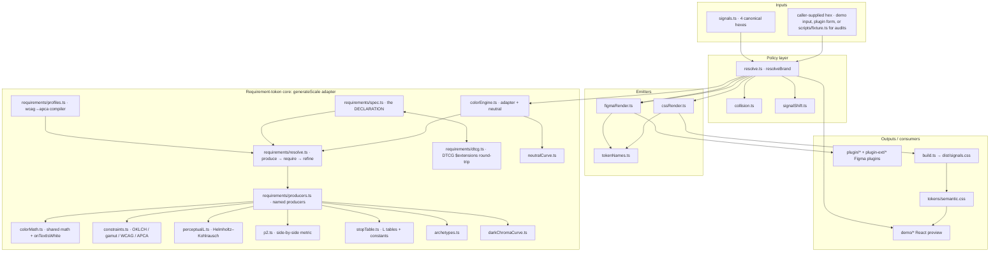

# OKChroma: System documentation

> Status: written 2026-06-29 from a skeptical, code-first read; re-verified claim-by-claim
> against `main` on 2026-08-06. The **code is the source of truth**; where older comments
> or docs disagreed, the code won. File references are `path:line` against main.

## 1. System Overview

**OKChroma is a color-system engine.** It generates a themeable color system around a primary seed color.

The key features of the system are:
- **perceptually uniform stops:** every step is the same same *perceived* lightness. regardless of hue. 
- **thoughtful stop groups:** okchroma acknowledges that primitives are broad but **not** agnostic. Each stop group has requirements that enable contrast-aware pairing.
- **accessibility-first construction:**
Compliance is built into generation (WCAG contrast targets, plus APCA boost for ctas) so you can be confident in every theme.


**What it produces:**

- **CSS custom properties:** `brandCss`/`neutralCss` (per family, light + dark) +
  `dist/signals.css`, the one output `build.ts` writes to disk, which can be aliased into
  your semantic system or used on their own. Per-brand CSS has no batch step — the demo
  and both plugins call `brandCss` live, on whatever hex they were given.
- **Figma variables:** written directly into a Figma file by the plugin.

---

## 2. Core Architecture

### The story in one paragraph

One hex enters `resolveBrand`. That function calls `generateScale`, which is a thin
adapter over the **requirement-token core** (`src/engine/requirements/`): a pure-data
**declaration** (`spec.ts`: per-stop producers, requirements, and roles) executed by a
**resolver** (`resolve.ts` + `producers.ts`) in three phases per stop: **produce** (hue →
chroma → lightness), **require** (declared floors: contrast), **refine** (chroma yields to
gamut). `resolveBrand` then layers **policy** on top: collision checks against the four
signals, signal shifts, the red complement. The resolved result is handed to an **emitter**
(CSS or Figma) that maps the computed color stops onto named tokens and chooses light vs
dark. There is no batch roster: `build.ts` writes only the brand-independent
`dist/signals.css`; the demo and both plugins call the exact same functions live, on
whatever hex they were handed.

### 2a. Architecture details

#### (A) Module map


```mermaid
flowchart TD
    subgraph Inputs["Inputs"]
      B[caller-supplied hex · demo input, plugin form, or scripts/fixture.ts for audits]
      SIG[signals.ts · 4 canonical hexes]
    end

    subgraph Policy["Policy layer"]
      R[resolve.ts · resolveBrand]
      COL[collision.ts]
      SH[signalShift.ts]
    end

    subgraph Core["Requirement-token core: generateScale adapter"]
      CE[colorEngine.ts · adapter + neutral]
      SPEC[requirements/spec.ts · the DECLARATION]
      RES[requirements/resolve.ts · produce → require → refine]
      PROD[requirements/producers.ts · named producers]
      DTCG[requirements/dtcg.ts · DTCG $extensions round-trip]
      CM[colorMath.ts · shared math + onTextIsWhite]
      CON[constraints.ts · OKLCH / gamut / WCAG / APCA]
      PL[perceptualL.ts · Helmholtz–Kohlrausch]
      P2[p2.ts · side-by-side metric]
      PROF[requirements/profiles.ts · wcag→apca compiler]
      ST[stopTable.ts · L tables + constants]
      AR[archetypes.ts]
      DCC[darkChromaCurve.ts]
      NC[neutralCurve.ts]
    end

    subgraph Emit["Emitters"]
      CSS[cssRender.ts]
      FIG[figmaRender.ts]
      TN[tokenNames.ts]
    end

    subgraph Out["Outputs / consumers"]
      BUILD[build.ts → dist/signals.css]
      SEM[tokens/semantic.css]
      DEMO[demo/* React preview]
      PLUG[plugin/* + plugin-ext/* Figma plugins]
    end

    B --> R
    SIG --> R
    R --> CE
    R --> COL
    R --> SH
    CE --> RES
    SPEC --> RES
    RES --> PROD
    SPEC <--> DTCG
    PROD --> CM & CON & PL & P2 & ST & AR & DCC
    PROF --> RES
    CE --> NC
    R --> CSS & FIG
    CSS --> TN
    FIG --> TN
    CSS --> BUILD
    BUILD --> SEM --> DEMO
    R --> DEMO
    R --> FIG --> PLUG
```


#### (A1) Module inventory

The same modules as a table: each piece, where it lives, what it does. Grouped bottom-up.

**Foundations: color math & perception (`src/engine/`)**

| Piece | Location | What it does |
|---|---|---|
| Color math core | `colorMath.ts` | Shared leaf module: OKLCH↔RGB, `makeStop` (gamut-clamped stop constructor), the on-text pole judge (`onTextIsWhite`, max-\|Lc\| preference, profile-law floors), the red-region metrics (`redGateDist` P1 + `redSolveDist`/`RED_GATE`/`RED_SOLVE`), `maxChromaAt`. No formula changes without a parity check. |
| Gamut & contrast constraints | `constraints.ts` | The master-gamut layer (P3): every generation-side judgment (chroma clamp, WCAG Y/ratio, APCA Y/Lc) runs in the master basis; emit-side hex stays sRGB: the render/emit split. |
| Perceptual lightness | `perceptualL.ts` | Nayatani Helmholtz–Kohlrausch apparent lightness: `apparentL`, the solvers (`solveLForApparent`, `solveCForApparent`), `perceptualRungL`, `perceptualDarkC`, `grayApparentL`. The space every placement solve works in. |
| P2 metric | `p2.ts` | The "truly different side-by-side" distance (C12) with bars `P2_D`/`P2_D_UP`, distinct from P1's at-a-glance confusion. Drives the dark cta exit and the red complement. Imports `helmlab` (the engine's one runtime dependency). |

**Declared registers: the data (`src/engine/`)**

| Piece | Location | What it does |
|---|---|---|
| Stop tables | `stopTable.ts` | The declared numbers: L scaffolds, `SCALE_C_LIGHT`/`SCALE_C_DARK` chroma tables (one table per mode, C10), `DARK_CTA_C` (the C16 cta chroma register: brand = trimmed, signal = identity), stop-8's 3:1 bound, `GOLD_SPINE`/`WARM_TORSION`, dark fill floors. |
| Dark chroma policy | `darkChromaCurve.ts` | `darkChromaCurve` (the H-K fill equalizer) and `darkCtaTrim` (the brand dark-cta trim, computed from `DARK_CTA_C`). |
| Signal identities | `signals.ts` | The four signals by identity: red, yellow, green, blue (renamed from info-color 2026-07-13), seed hexes + per-signal dark floors. |
| Archetypes | `archetypes.ts` | The six lightness anchors (near-black → light), `classifyArchetype`, the hover rule (`hoverL`). |
| Neutral curve | `neutralCurve.ts` | The neutral's chroma shape: the neutral is generated from a tint hue at four tint levels. |

**The requirement-token resolver (`src/engine/requirements/`)**

| Piece | Location | What it does |
|---|---|---|
| Declaration | `spec.ts` | The requirement declaration as pure serializable data: every stop and role with its producer by name, contrast requires, register bindings. No math. |
| Resolver | `resolve.ts` | Executes the declaration: per stop, producer (hue→chroma→L) → require (contrast clamp, iterated) → refine (chroma yields to gamut at emit). Assembles the cta roles: enforce re-solves (wcag 4.5 / apca lane Lc bar, pole-symmetric), the C12 exits, the prominence floor and its C16 flat-register exception. |
| Producers | `producers.ts` | The named producer implementations: light/dark placement, the delta model (dark = f(light) in apparent space), cta anchors, APCA enforcement solvers, `solveBrandExit`/`solveDarkCtaExit`, `flatDarkCtaL` (the derived secondary's dark register). |
| Profiles | `profiles.ts` | The contrast-profile compiler: `withProfile` maps every declared wcag require onto its APCA equivalent. **WCAG is the shipped lane** (`SHIPPED_PROFILE`, `src/build.ts`, owner 2026-07-29); the apca lane exists in code, nothing ships through it. |
| Portability | `dtcg.ts` | Serializes the declaration to DTCG color tokens (frozen `$value` + the requirement in `$extensions`) and parses it back. |

**Theme layer (`src/engine/`)**

| Piece | Location | What it does |
|---|---|---|
| Scale generator | `colorEngine.ts` | `generateScale`, the adapter over the resolver, plus the `GeneratedScale` contract, `generateNeutralScale`, `neutralTintHue` (the C48 tint-hue source rule), and `GenerateOptions`. |
| Brand & theme resolver | `resolve.ts` | `resolveBrand`/`resolveTheme`, the top of the engine. Per-profile signal sets, collision machinery, the red complement variant, C12 `ctaSolve` injection, and the secondary offering: derived (`DEFAULT_SECONDARY` seed transform + gap registers), the same transform on a supplied seed, exact (full standard ramp), or outline (exact ramp, cta re-resolved at emit). |
| Collision gates | `collision.ts` | Type-1 hue-family detection (wash hues within 15° + vividness qualifier) and the value test (hue gate + ΔE gate) deciding signal collisions and annotation. |
| Signal shifts | `signalShift.ts` | Per-brand signal adjustments: yellow's lemon shift and the green/blue swap variants, split-keyed by the brand's hue. |

**Emit: the output (`src/engine/`, `src/`)**

| Piece | Location | What it does |
|---|---|---|
| CSS emitter | `cssRender.ts` | `brandCss`/`signalsCss`, custom properties per family and mode: the scale stops, the cta fill trio (`solid-fill`/`solid-fill-hover`/`solid-fill-pressed`; the text-style cta is the ink stops themselves since the 2026-08-12 cta-ink deletion), `solid-on` (solid pole or the soft pole-at-alpha), the gated `solid-edge` alias onto the system alpha ladder, P3 `@supports` override blocks, the outline secondary's cta shape. Signals emit under their **role names** (`--critical-*`/`--warning-*`/`--positive-*`/`--info-*`); identity names stay engine-internal. |
| Figma emitter | `figmaRender.ts` | `themeToFigma`, the same theme as Figma variable collections (both plugins consume it). |
| Token vocabulary | `tokenNames.ts` | The shared naming: paper-99/97/95, wash-92–80, wax-74, ink-53/42-aa/30-aaa, the cta state families, ons; one vocabulary across CSS and Figma. |
| Public API | `index.ts` | The entry point: `resolveBrand`/`resolveTheme`. |

**Product data & pipelines (`src/`)**

| Piece | Location | What it does |
|---|---|---|
| Token build | `build.ts` | The `npm run generate` entry: writes the one static output, `dist/signals.css`, under `SHIPPED_PROFILE = 'wcag'`. There is no brand roster in `src/` and no batch loop: per-brand CSS is generated live by whichever consumer calls `resolveBrand`/`brandCss` on a hex it was handed (the demo's hex input, a plugin's form field). |

The old `brands.ts` / `secondaries.ts` drink-set roster and `illustration.ts` (an SVG
legend-hex swap) are gone (owner 2026-08-11): nothing shipped consumed them, so they carried
demo-only concerns that had no reason to live next to the engine. Their audit-fixture role is
now `scripts/fixture.ts`, a small named color set with no display names or demo flag — it
exists only to exercise the engine's instruments. The demo's one illustration
(`demo/heroIllo.ts`) now themes itself directly: its SVG markup references the live CSS
custom properties (`var(--brand-ink-53)` etc.), so it re-themes with the rest of the page
for free, no recolor step.

Around the engine sit the audit gates in `scripts/` (with their blessed snapshots, driven by
`scripts/fixture.ts`) and the consumers: the demo preview, the two Figma plugins. The product
boundary is the layers above: declaration in, resolved theme out, emitted as CSS or Figma
variables.

#### (B) Pipeline stages

| # | Stage | File · function | In → Out |
|---|-------|-----------------|----------|
| 1 | Decode + context | `producers.ts` · `buildContext` | hex + opts → OKLCH seed, archetype, and the aesthetic state (chroma boost, mutedness, cream gate, warm-drift caps, red-repel weights) |
| 2 | Compile | `colorEngine.ts` · `generateScale` (adapter) | caller opts + the built-in declaration → a per-mode `ModeSpec` for the resolver |
| 3 | Resolve stops | `resolve.ts` · `resolveRamp` | per declared stop: **produce** (hue → chroma → `perceptualRungL`) → **require** (declared contrast floors bind: down-clamp in light, raise-off-paper in dark) → **refine** (chroma yields to gamut). Stops resolve in order, so a require can reference an already-resolved stop |
| 4 | Resolve roles + ons | `resolve.ts` | off-scale `solid-fill`/`solid-fill-hover`/`solid-fill-pressed` roles (anchor = the brand's own lightness, floored in dark; the on-fill enforce re-solve last); the `solid-on` pole chosen by the declared `ons` rule, never feeding back into a fill except through the enforce |
| 5 | Assemble | `colorEngine.ts` adapter | resolved ramps → the `GeneratedScale` contract (light[], dark[], the six cta state fills, on-booleans) |
| 6 | **Policy** | `resolve.ts` (engine) · `resolveBrand` | runs collisions; may re-call the engine with new options; computes signal overrides |
| 7 | Emit | `cssRender.ts` / `figmaRender.ts` + `tokenNames.ts` | `GeneratedScale` → named CSS vars or Figma variable tree |
| 8 | Drive | `build.ts` (static) / demo / plugin (live) | writes `dist/signals.css` / renders preview / writes Figma |

Structural facts worth stating plainly:

- The public API is `resolveBrand`/`resolveTheme` (policy entry) and `generateScale`
  (engine entry); consumers, the plugins included, never see the reqtoken internals.
- The engine runs **~6× per brand** (brand, secondary, neutral, and the cached signal
  scales). The four **signal scales are generated once at module load** (`SIGNAL_SCALES`,
  `resolve.ts:43`) and reused everywhere.
- **Light/dark is computed together, chosen at render.** Both ramps resolve from their
  declared `ModeSpec` and land on one `GeneratedScale`. `brandKindBody(prefix, scale, mode)`
  (`cssRender.ts`) picks `scale.light` vs `scale.dark` per mode; CSS emits a
  `[data-brand]` block (light) and a `[data-brand][data-theme="dark"]` block (dark).
- **Stops carry numbers; the cta is a named role with no number**: in the declaration
  they are literally different kinds, so a stop/cta confusion cannot recur.

The data structures that flow through everything:

```ts
// the declaration (pure data, src/engine/requirements/spec.ts)
ModeSpec       = { stops: StopReq[], roles: RoleReq[], ons: { onFill } }
StopReq        = { stop, rootL, group, produce: {hue, L, chroma}, satFraction?/baseC?/chromaMult?, require? }
RoleReq        = { role: 'cta'|'cta-hover'|'cta-pressed', produce, floorL, chromaMult }

// the resolved output (the public contract)
ColorStop      = { stop, L, C, H, r, g, b }
GeneratedScale = { name, archetype, brandL/C/H,
                   onFillTextIsWhite(+Dark), light[], dark[],
                   cta, ctaHover, ctaPressed (+Dark ×3),
                   identityHex? }
ResolvedBrand  = { scale, shearDeg, redRepel: {light,dark}|null,
                   warningVariant, pending[], signalOverrides[] }
```

#### (C) Output token vocabulary (`tokenNames.ts`)

| Stops | Token names | Role |
|---|---|---|
| 1–2 | `paper-99`, `paper-97` | the page and card planes |
| 3 | `paper-95` | surface plane (light sunken / dark high), renamed from wash-3, owner 2026-07-24 |
| 4–7 | `wash-92` … `wash-80` | low-hierarchy fills, borders, decorative |
| 8 | `wax-74` | WCAG 1.4.11 **3:1** non-text step (borders, UI elements) |
| 9 | `ink-53` | emphasis fill AND first text stop (4.5:1, the 2026-07-29 highlight collapse) |
| 10 | `ink-42` | the between text stop (6.5:1, C49, promoted from the retired text-cta hover state) |
| 11 | `ink-30` | strong text (7:1). The three ink stops read as states ARE the text-style cta (rest 53 / hover 42 / pressed 30); the separate `cta-ink` + `cta-ink-strong` alias trios were deleted 2026-08-12 |
| off-scale roles | `solid-fill`, `solid-fill-hover`, `solid-fill-pressed` | the pulled-out solid button fill and its states |
| aliases | `solid-edge` | the gated border onto the system alpha ladder |
| computed | `solid-on` | black/white text for the fill (solid pole, or the soft pole-at-alpha on quiet fills) |
| literal | `identity` | the exact input hex (brand / secondary only) |
| anchors | `paper-100`, `ink-0` | universal per-scheme extremes (paper-100 = the neutral's resolved stop 0; ink-0 = literal black/white, flipped per mode) |

`tokens/semantic.css` is a **static, hand-authored alias layer** (never generated): it maps
human role names (`--surface-*`, `--fg-*`, `--border-*`, `--critical-bg-*` and friends)
onto the emitted primitives. The signal primitives themselves already carry role-name
prefixes at emit (`--critical-*` etc.); only the primitives change per brand.

### 2b. The requirement schema

> Field-by-field reference for the serialized token format, with real emitted JSON
> examples, lives in **[schema.md](schema.md)**. This section is the conceptual model.

The engine's core idea: **a token is a requirement the engine solves, not a frozen value.**
The declaration (`src/engine/requirements/spec.ts`) is pure, serializable data; the resolver executes
it. Three phases per stop, in order:

- **produce**: the forward formula. Named producers, referenced by name in the data:
  `hue: 'warm-drift' | 'warm-torsion' | 'constant'`, `L: 'perceptual' | 'fixed'` (plus
  `'anchor'`/`'hover'`/`'pressed'` for roles), `chroma: 'ladder' | 'brand'`. The producer
  *implementations* (the Nayatani solve, the warm drift, the chroma ladder/envelope
  blend, the aesthetic state) live in `producers.ts` under the resolver id
  `okchroma-reqtoken@2`; they are the house style *of this resolver*, not portable data.
- **require**: declared floors, checked and enforced against **resolved** stops (never a
  cached value, so a pushed stop automatically re-solves everything referencing it):
  - `{ metric: 'wcag', against, target }`: `wax-74` declares `against: 'paper-95'`
    directly (3:1), and the resolver honors that anchor as written. `ink-53`,
    `ink-42`, and `ink-30` declare `against: 'paper-97'` in `spec.ts` (4.5 / 6.5 /
    7.0), but the shipped WCAG lane overrides that at resolve time: `resolve.ts`'s
    `wcagAnchorStop` re-anchors every stop from 9 up at paper-95 instead, the nearest
    paper, so the declared paper-97 anchor is what only the apca lane actually reads
    (byte-identical there), while the shipped wcag lane clears paper-95. On top of that,
    every stop from wax-74 up also clears the worst paper the family's OWN generated
    NEUTRAL can produce at any hue (`NEUTRAL_P3_WORST_SHIP_Y`, C44): a brand's own
    paper-95 is not always the nearest paper once the neutral is in scope. Declared in
    **both modes** (light clamps down; dark raises off the paper; a placement that
    already clears doesn't move).
  - `{ metric: 'min-separation', against, target }`: supported by the resolver for
    portable specs; **the shipped spec no longer declares any** (the identity-curve
    paper/wash shape guarantees the seams instead, see the comment directly above the
    `LIGHT` export in `spec.ts`).
  - the `ons` block: the `solid-on` pole choice (`apca-pole` preference) with the law
    `{ ratioFloor: 4.5, coEnforceLc: 65 }`: the chosen pole must pass WCAG 4.5 or the
    fill re-solves, and the fill co-clears APCA Lc 65 (critical rides 50). On-text is
    chosen on one criterion: it passes.
  A require the resolver cannot meet yields an explicit `unresolvable` marker, never a
  silent fudge.
- **refine**: chroma yields to the sRGB gamut at emit.

**The spec/resolver line** (what's portable vs what isn't): stop identity, rootL ladders,
per-stop chroma params, producer *names*, and every requirement are data; they serialize
to DTCG tokens (`dtcg.ts`: frozen `$value` fallback for any DTCG tool + the live
requirement in `$extensions['org.okchroma.requirement']`, round-trip-proven by
`research/reqtoken/reqtoken-portability.ts`, parked research, not run by CI; editing a
requirement in the token file changes the
re-resolved value). The producer implementations and their constants stay behind the
versioned resolver id: twenty aesthetic constants in a token file would be fake
portability.

**The gate:** `npm run req:audit` resolves an agnostic 24-hue × 3-chroma sweep in both
modes and verifies every *declared* requirement plus structural invariants (totality,
monotonic ladder, gamut, role floors, on-pole validity). Requirement-satisfaction is the
contract; the blessed snapshots remain the value-regression pin.

### 2c. Design decisions (the "design touches")

These are the deliberate adjustments layered onto a naive ramp, grouped by goal.

#### Aesthetics / brand fidelity

- **OKLCH throughout** (`constraints.ts`): a perceptual space, so steps look evenly
  spaced and a ramp holds one hue from light to dark.
- **Warm-hue spine drift**: `GOLD_SPINE` (a 6-point L→H table, 47° dark to 110° light,
  `stopTable.ts`) + `WARM_TORSION` (weight curve `[[40,0],[50,1],[88,1],[104,0]]`, travel
  0.55, cap ±24°). Warm stops rotate toward the clean warm hue at each lightness, weighted
  by the brand's distance from that path (gaussian, σ 20°), so **dark gold/orange stays
  gold instead of going olive or brown**. The cool edge fades to zero by ≈ H104: lemon
  keeps its identity hue. Light applies it through the inline spine drift
  (`producers.ts`, dynamic cap 24+8u), dark through `torsionedHue`.
- **Red-signal repel, nearest side**: `redRepelShiftDeg` (`colorMath.ts`): a brand ramp
  near the red signal's hue rotates its stops away from the signal, exiting by the nearest
  side of the pivot `RED_PIVOT_H = 33.3°` (the signal hue; ties exit cool). Cool of the
  pivot, the shipped curve is `RED_COOL_DEG = 10.8°` × `redCoolWeight`, with a
  `RED_PIVOT_EXIT_DEG = 14°` floor near the pivot; warm of the pivot, the same magnitude
  pushes **warmer** ("tomato goes orange-er", fading out by ≈ H50), so a warm-of-red brand
  is never dragged through the signal. Applied to the scale stops in both modes: light in
  `lightHueAt`; dark via `coolRedDark` on `darkH`, and the dark washes also inherit the
  light shift through the delta model, which is why even exact mode's tints still repel
  (measured 2026-08-06: #D22B2B exact, wash-89 at H 16.9 in both modes, cta untouched).
  The CTA is exempt on both sides (C12 v8: cta red de-collision belongs to the joint solve
  alone; the dark cta rides identity hue). It is **brand-only**: the red *signal* keeps its
  identity hue in both modes; signals pass `suppressRedCool: true`.
- **Style lever** (`deeper` / `full-chroma`): a `GenerateOptions` field, set directly by the
  caller (the demo exposes `full-chroma` as a toggle; the audit fixture, `scripts/fixture.ts`,
  carries a `deeper` case). `deeper` pushes toward the cream/brown envelope, gated to the ambiguous semi-muted warm
  band (H 55–100, mid mutedness); a no-op outside it. `full-chroma` releases the vividness
  cap for any seed (the ladder scales with the seed's true chroma; the dark cta rides the
  identity chroma policy instead of the brand trim); gamut clamps still bound the emit.
- **Vividness reads the gamut's capacity** (C51, `producers.ts`): the chroma ladder's
  reference is `min(VIVID_C, medianGamutCAt(brandL))`, hue-agnostic: the gamut's chroma
  ceiling collapses toward the poles, so a pastel near its achievable ceiling measures
  vivid and keeps a vivid ramp instead of being read as a gray.
- **Chroma boost** near hue ≈ 90° (`chromaBoost`, `producers.ts`) for luminous warm
  hues that would otherwise read flat.

#### Accessibility

- **Helmholtz–Kohlrausch lightness solve**: at equal measured luminance, a saturated
  color *looks* brighter than gray, by a hue-dependent amount (large for blue/red/violet,
  small for yellow-green). `perceptualL.ts` implements the **Nayatani (1997)** model
  (`apparentL`); `perceptualRungL` solves the *measured* L at which each stop's *apparent*
  lightness matches a common target. → A high-boost hue (blue) is placed at a lower
  measured L, a low-boost hue (yellow-green) higher, so every step reads the same across
  brands. **The light ramp solves every stop this way. Dark rides its calibrated ladder**
  (deliberate: apparent-lightness solving in dark makes blue recede), with the C24 band
  lift and the C37 wash lift declared in contrast space. `divergence-audit` gates the
  residual per family × mode × stop. (The off-scale CTA is never solved; it carries the
  brand fill's own lightness.)
- **Dark-mode "dimmer"**: `perceptualDarkC` solves the *chroma* whose apparent lightness
  matches gray + boost at the dark rung's fixed L (this is the live `darkChromaCurve`). On
  top of that, `darkCtaTrim` trims the **brand** dark-fill chroma (with extra damping near
  blue 265° and red-magenta 345°). The signals ride the identity register instead
  (`DARK_CTA_C`: brand = trimmed, signal = identity, C16).
- **Dark fills lift, never sink**: `dark9L = max(scaleL, DARK_*_MIN_L)` (0.63 / 0.70): a
  too-dark fill lifts to stay visible on a dark background; a vivid fill is never pulled
  down (identity preserved).
- **Stop-8 = WCAG 1.4.11 3:1, declared in both modes**: `STOP_8_NONTEXT_CONTRAST = 3.0`,
  a requirement on the declared stop (`spec.ts`) against `paper-95` directly; light
  iterates a fixed-point clamp down; dark raises a failing hue off the near-black paper.
- **Text-stop contrast floors, declared in both modes**: `ink-53` at 4.5:1, `ink-42`
  at 6.5:1, `ink-30` at 7:1, declared in `spec.ts` against `paper-97` but resolved by
  the shipped WCAG lane against paper-95, the nearest paper (`resolve.ts`'s
  `wcagAnchorStop`), and additionally cleared against the worst paper the family's own
  generated neutral produces at any hue (C44's `NEUTRAL_P3_WORST_SHIP_Y`). See §2b for the
  full mechanism.
- **Seams by construction**: the paper/wash ladder rides an identity-curve shape that
  keeps every seam open for any seed (low-chroma grays and muted warms were the failure
  cases); the resolver still supports declared `min-separation` floors for portable specs,
  but the shipped spec no longer needs any (`spec.ts`, the comment above the `LIGHT`
  export).
- **On-fill text by one criterion: it passes**. `onTextIsWhite` (`colorMath.ts`) picks
  black or white; the chosen pole must pass WCAG 4.5 or the **fill moves** (never the
  text), and the fill co-clears APCA Lc 65 in both modes (critical 50; exact fills and
  exact secondaries are inert). Quiet fills (the derived secondary, the neutral) carry the
  pole **at alpha** (`SOFT_ON_CTA_ALPHA` .75/.80), gated per brand by a WCAG 4.5 pass on
  all three fill states in the shipped 8-bit basis (`softOnCtaPasses`).
- **Low-visibility cta border** (C41): every family's cta fill is judged against the page
  by APCA; below \|Lc\| 15 the family's `solid-edge` resolves to a system alpha-ladder
  stroke (primary 016, secondary 006, neutral 008), otherwise to the
  transparent variable. Components always carry the border, so layout never shifts.
  Default on, per-brand opt-out.

#### Differentiation (brand vs. status signals)

- **Four canonical signals** (red / yellow / green / blue), generated once, named by
  identity in the engine and emitted under role names (critical / warning / positive /
  info; owner 2026-07-27).
- **Collision tests**: `checkHueCollision` (wash hues within 15° + vividness qualifier)
  for family collisions; `checkCollision` (hue gate ≤ 30° plus OKLab ΔE ≤ 0.16 light /
  ≤ 0.10 dark) for value collisions between rendered fills.
- **Red collision, the joint solve (C12 v8)**: a brand whose cta sits inside the
  owner-calibrated true-red region exits by its nearest edge (deep and vivid reds go
  deeper, into burgundy when needed, pinks lighten, vivid oranges brighten; `RED_SOLVE`,
  `solveBrandExit`), and the red signal complements from the error-credible range on the
  opposite side of the brand when canonical red would still sit too close
  (`redComplementVariant`). Where no clean complement exists, canonical red ships plus
  outline advice for destructive controls. The older rung-1 darken, muted dark float, and
  `errorComponentRule` are deleted.
- **Signal shifts**: `pickSignalShift` (`signalShift.ts`): yellow → cooler *lemon*;
  green → teal-side / yellow-side; blue → cyan-side. The direction depends on which side of
  a hue split the brand sits, so the signal stays distinct. (Blue's magenta side is
  unreachable since the 2026-07-11 seed lift, an accepted loss, CATALOG C17; the signal
  was renamed from `info-color` to `blue` once only blue directions remained.)
- **The secondary de-conflicts too** (C45): a real secondary is checked against the
  signals the same way. Red and yellow offer no variants, so a colliding secondary yields
  to the subtle treatment; green/blue variants are adopted only if they clear **both**
  brand colors; the primary wins ties. Residual overlaps ship as advice (`pending[]`),
  never a silent move.

#### Generated neutral

- The neutral is **generated from a tint hue** (`generateNeutralScale`): a near-gray
  (C ≈ 0.006) at the tint hue, run back through `generateScale` with a `neutralChromaCurve`.
  The tint hue is a **stored source, never a frozen value** (C48, `neutralTintHue`):
  primary by default, the secondary's seed hue followed live, or a custom hex's hue.
  Tint levels `pure` / `default` / `medium` / `branded` scale the tint at every stop in
  both modes (`medium` keeps the pre-2026-08-11 default strength; `default` is 0.75x of it).
  Its `solid-fill` is intentionally **low-hierarchy**, tracking the scale's own stop 4 (cta) /
  stop 5 (hover) so it **flips per mode**: a near-white wash in light, a dark wash in
  dark, with `solid-on` recomputed for legibility in each (shipped soft, at alpha).

### 2d. The extended plugin's ownership zones and descope posture

The extended Figma plugin (`plugin-ext/`, Enterprise-only) prefixes every emitted
variable path with an OWNERSHIP ZONE (2026-08-18, replacing the earlier register
prefixes): `base/` marks engine-owned rows, where hand edits are deliberately not
rebuilt by a re-apply, and `utility/` marks team-touchable rows (the surface planes,
shadows, the scrim) that the engine never reads back, written last so they shelve
together in the panel. The zone segment is stripped from every WEB code syntax, so
dev-facing names match the CSS custom properties. This is a plugin-side concern only:
the CSS build and the community plugin (`plugin/`) have no notion of it. Two kinds of
rows share the base/ zone:

- **ramp stops and plumbing**: a single resolved color, no state. The scale stops
  (`base/neutral/paper-99`, `base/brand/ink-53`, … — flat leaves,
  band flattening 2026-08-12), the system
  poles and alpha ladder (`base/abs-black`, `base/alpha/016`,
  …).
- **roles**: a state-carrying usage decision, kept in its natural group. The cta family
  inside its own family group (`base/brand/solid/fill-hover`) and the
  system rows `base/link/*` (default/hover/pressed plus the inverse leaves
  inverse/inverse-hover/inverse-pressed: the same link seed re-solved for
  text on ink-30 surfaces via `resolveLinkInverseTrio`, anchored at `INK_30_GROUND`), and
  `base/surface/dim|low|base|high`.

**The seam.** `payload.registerPath(path)` (`plugin-ext/payload.ts`) is the one function
that applies the prefix, as the FINAL step of `toFlat()`, after every other rename
(identity re-homing, link-state remapping) has already settled the path. It prefixes
`system/*` rows and every path matching `FAMILY_PREFIXES` (which color family a path
belongs to), and leaves anything unknown untouched. One function, one seam: nothing else
in the payload or the plugin decides a path's spelling at this level. `ROLE_BANDS`
(`cta/`) survives beside it as the descope posture's
visibility line, mirrored in `code.ts` as `isRoleRow`.

**Healing old files.** A file saved before 2026-08-07 has no register prefix, and a file
from the 2026-08-07..11 window carries the retired two-register spellings
(`semantic/<family>/cta/*`, `semantic/link/*`, `semantic/surface/*`). `code.ts`'s
`legacyCandidates()` recovers both: `RENAMED_GROUPS` carries the universal strip
(`'' → 'base/'`), the system-root strip (`'' → 'base/'`), the
register swap (`'semantic/' → 'base/'`) and exact entries re-homing the semantic-era
link/surface rows (`'semantic/link/' → 'base/link/'`,
`'semantic/surface/' → 'base/surface/'`), composed with the existing per-role
and per-leaf rename tables (`RENAMED_LEAVES`, the signal role renames) so a file untouched
since before the role rename, the Stage B leaf relabel, or the register era can still
resolve to its current path in one `ensure()` call. The rule stays one-hop: a chained
old→mid→new table would strand a file on the middle name, so every table points straight
at the final spelling.

**Descope posture.** The ramp stops and plumbing rows are implementation detail; a
designer should bind to the role names instead. The base collection stores this as file
state (`okchroma-ext-descope` plugin data on the base collection, not per-brand): when on
(the default; absent reads as on), `ensure()` sets every non-role variable's `scopes` to
`[]`, hiding it from every Figma color picker, while the role rows (`isRoleRow`: the cta
bands, `system/link/*`, `system/surface/*`) always keep `ALL_SCOPES`. The UI's checkbox
reads this on load (the `file-state` handshake) and every apply, single or roster,
re-stamps it and re-applies the scopes, so a scope a designer hand-edited in Figma's own
panel always reverts on the next apply.

**Hand-authored rows.** Nearly every row is generated from the resolved theme via
`payload.toFlat()`. The one exception is the four elevation planes,
`base/surface/dim|low|base|high`: `code.ts` creates these itself
(`ensure('base/surface/dim')`, etc.), outside the payload token stream, then
wires each as a scheme-divergent alias onto the NEUTRAL's own resolved paper stops
(`base/neutral/paper/*`), never onto the family being themed:

| plane | light aliases | dark aliases |
|---|---|---|
| `system/surface/dim` | `neutral/paper-95` | `neutral/paper-100` |
| `system/surface/low` | `neutral/paper-97` | `neutral/paper-99` |
| `system/surface/mid` | `neutral/paper-99` | `neutral/paper-97` |
| `system/surface/high`  | `neutral/paper-100` | `neutral/paper-95` |

**Apply never deletes.** A path in an existing base file that the current payload no
longer emits (an orphan, left behind by a deleted or renamed token) is counted and
reported to the UI, never removed: `ensure()` only creates or renames variables it
recognizes, so a designer's own variables, and any row the plugin has stopped writing,
are left exactly alone. The remedy for a genuinely wrong row is the designer's own delete;
the next apply reseeds whatever it's supposed to own.

---

## 3. Key Dependencies

The engine has **one runtime dependency: `helmlab`** (imported by `p2.ts` for the
side-by-side perceptual distance metric that drives the dark cta exit and the red
complement). Everything else in `src/` is hand-written: OKLCH ↔ sRGB conversion, gamut
clamping, WCAG/APCA luminance, and the Helmholtz–Kohlrausch model live in
`constraints.ts` and `perceptualL.ts`. There is no color library.

The other packages exist for **tooling and the demo**, not the engine:

| Package | Type | Why it's here |
|---|---|---|
| **helmlab** | dep | The P2 side-by-side metric (`p2.ts`), the engine's one runtime dependency. |
| **esbuild** | dev | The only build tool: bundles the Node token generator, the browser demo, and the plugins; provides `--watch`. |
| **typescript** + **@types/*** | dev | The codebase is TypeScript; `npm run typecheck` runs `tsc --noEmit`. |
| **react** + **react-dom** | dev | Power the **demo preview app only**. The engine never imports them. |
| **lucide-react** | dep | Icons in the **demo only**. *(A candidate to move to `devDependencies`.)* |

The scripts under `scripts/` are internal diagnostics/audits (contrast sweeps, smoothness
checks, Figma verification). They are **not part of the engine** and aren't needed to
build or use it.

---

## 4. Setup Guide (run locally from scratch)

**Prerequisites:** Node 18+ (the build targets `node18`; CI uses Node 20) and npm.

```bash
# 1. Install
npm install

# 2. Build everything: bundles the generator, runs it to produce dist/signals.css,
#    and bundles the demo (dist/demo.js). Per-brand CSS is generated live in-browser.
npm run demo:build

# 3. View the demo. Serve the repo ROOT (demo/index.html references ../dist and ../tokens):
npx serve .
#    then open  http://localhost:3000/demo/index.html
```

**Live editing**

```bash
npm run dev        # esbuild --watch: rebuilds the demo on save (refresh the browser)
```

**Figma plugins**

```bash
npm run plugin:build       # the community plugin  → plugin/dist/*
npm run plugin-ext:build   # the extended plugin   → plugin-ext/dist/*
# In Figma: Plugins → Development → Import plugin from manifest… → pick the plugin's manifest.json
```

**Verification / diagnostics** (the full audit set lives in `package.json`)

```bash
npm run typecheck        # tsc --noEmit
npm run audit            # dark-mode audit        (add :bless to update the snapshot)
npm run highlight-audit  # highlight/on-fill audit (add :bless)
npm run audit:divergence # light↔dark + cross-family divergence audit (add :bless)
npm run req:audit        # the requirement gate: every DECLARED requirement, agnostic sweep, both modes
npm run smooth           # ramp smoothness audit  (smooth:baseline to re-record)
npm run figma:verify     # validates the Figma emitter output
npm run generate         # regenerate dist/signals.css only (requires a prior build)
```

> Note: `npm run build` and `npm run demo:build` run the exact same script
> (`node esbuild.config.js`, no flags): bundle `src/build.ts`, run it to produce the token
> CSS, then bundle the demo. There is no `--full` mode; `esbuild.config.js` only branches
> on `--watch`, `--plugin`, and `--plugin-ext`. `demo:build` is the one-stop command;
> `build` is its alias.

**Deploy:** `.github/workflows/pages.yml` deploys the demo to GitHub Pages on push to
`main` (or manual dispatch): `npm ci` → `npm run demo:build` → flatten `dist/` + `tokens/`
into `_site/` (rewriting `../` paths for the `/okchroma/` project subpath) → publish.

---

## Known limitations (intentional, not bugs)

1. **Blue's magenta-side variant is unreachable** with the current signal seeds (the
   2026-07-11 seed lift), an accepted loss, tracked as CATALOG C17.
2. **Residual advisory overlaps ship as annotations** (`pending[]`), not silent moves:
   after the automatic solves (red joint solve, signal variants, the C45 secondary
   de-confliction), whatever remains is the owner's call by design.
