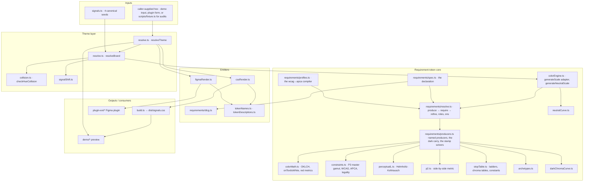

# OKChroma: system documentation

The maintainer's map: what each module does, the pipeline stage by stage, the data
structures that flow through it, and the extended plugin's write path. The code is the
source of truth; where a claim here and the code disagree, the code wins. The docs site
explains the mechanisms with values rendered from the engine:
[egerrity.github.io/okchroma/#/docs](https://egerrity.github.io/okchroma/#/docs).

## 1. System overview

OKChroma is a color-system engine. It resolves a themeable color system around a primary
seed color (and optionally a secondary), in light and dark together, with the contrast
requirements solved during generation, and emits it three ways from one resolved theme:

- **CSS custom properties**: `brandCss` / `neutralCss` (per family, light + dark blocks)
  and `signalsCss` (the brand-independent `:root` block, the one static output
  `src/build.ts` writes to `dist/signals.css`). Per-brand CSS is generated live by whichever
  caller resolves a hex; there is no brand roster.
- **Figma variables**: `themeToFigma` returns a light and a dark group tree; the extended
  plugin writes it into a file.
- **DTCG requirement tokens**: `emitDtcgRamp` serializes one ramp with a frozen value and
  the live requirement per token. API only; no shipped pipeline writes the file.

The demo (`demo/`) and the plugins (`plugin-ext/`, `plugin/`, `plugin-unify/`) are
front-ends. The product is the engine and what it emits.

## 2. Module map


```mermaid
flowchart TD
    subgraph Inputs["Inputs"]
      B[caller-supplied hex · demo input, plugin form, or scripts/fixture.ts for audits]
      SIG[signals.ts · 4 canonical seeds]
    end

    subgraph Policy["Theme layer"]
      RT[resolve.ts · resolveTheme]
      R[resolve.ts · resolveBrand]
      COL[collision.ts · checkHueCollision]
      SH[signalShift.ts]
    end

    subgraph Core["Requirement-token core"]
      CE[colorEngine.ts · generateScale adapter, generateNeutralScale]
      SPEC[requirements/spec.ts · the declaration]
      RES[requirements/resolve.ts · produce → require → refine, roles, ons]
      PROD[requirements/producers.ts · named producers, the dark carry, the stamp solvers]
      PROF[requirements/profiles.ts · the wcag→apca compiler]
      CM[colorMath.ts · OKLCH, onTextIsWhite, red metrics]
      CON[constraints.ts · P3 master gamut, WCAG, APCA, legality]
      PL[perceptualL.ts · Helmholtz-Kohlrausch]
      P2[p2.ts · side-by-side metric]
      ST[stopTable.ts · ladders, chroma tables, constants]
      AR[archetypes.ts]
      NC[neutralCurve.ts]
      DCC[darkChromaCurve.ts]
    end

    subgraph Emit["Emitters"]
      CSS[cssRender.ts]
      FIG[figmaRender.ts]
      DTCG[requirements/dtcg.ts]
      TN[tokenNames.ts · tokenDescriptions.ts]
    end

    subgraph Out["Outputs / consumers"]
      BUILD[build.ts → dist/signals.css]
      DEMO[demo/* preview]
      PLUG[plugin-ext/* Figma plugin]
    end

    B --> RT --> R --> CE
    SIG --> R
    R --> COL & SH
    CE --> RES
    SPEC --> RES
    PROF --> RES
    RES --> PROD
    PROD --> CM & CON & PL & P2 & ST & AR & DCC
    CE --> NC
    SPEC --> DTCG
    RT --> CSS & FIG
    CSS --> TN
    FIG --> TN
    CSS --> BUILD --> DEMO
    RT --> DEMO
    FIG --> PLUG
```

### Module inventory

**Foundations: color math and perception (`src/engine/`)**

| Piece | Location | What it does |
|---|---|---|
| Color math | `colorMath.ts` | OKLCH ↔ sRGB (`hexToOklch`, `oklchToSrgbUnclamped`), `makeStop` (the gamut-clamped stop constructor), `srgbEmitChannels` / `masterEmitChannels` (the emit split), the on-text pole judge `onTextIsWhite`, the red metrics (`redGateDist`, `redSolveDist`, `RED_GATE`, `RED_SOLVE`, the keep box and brick band), `redRepelShiftDeg`, the spine and torsion helpers, `maxChromaAt` and `medianGamutCAt`, and the declared aesthetic constants (the brand bell, the deeper band, the vividness reference). |
| Gamut and contrast | `constraints.ts` | The master gamut (`MASTER_GAMUT = 'p3'`): every generation-side judgement (chroma clamp, WCAG luminance, APCA luminance) runs in it; emit clamps down to sRGB. `legalRatio` (a ratio judged on both renditions), `shippedY` (the 8-bit sRGB rendition's luminance), the contrast solvers (`findMaxLForContrast`, `findLForContrast`, `findLForContrastUp`), `apcaY` / `apcaLc`. |
| Perceptual lightness | `perceptualL.ts` | The Nayatani (1997) Helmholtz-Kohlrausch model: `apparentL`, `grayApparentL`, `meanBoost`, the solvers `solveLForApparent` / `solveCForApparent`, `perceptualRungL` (the light placement solve) and `perceptualDarkC` (the dark chroma equalizer, used for dark paper-0 and as the stamp trim's gate). |
| Side-by-side metric | `p2.ts` | `p2Diff`, the adjacent-pair distinctness distance (helmlab, the one bundled dependency) with its bars `P2_D` / `P2_D_UP`. Drives the dark stamp exit and the red complement. |

**Declared data (`src/engine/`)**

| Piece | Location | What it does |
|---|---|---|
| Stop tables | `stopTable.ts` | `ROOT_L_LIGHT` / `ROOT_L_DARK`, `SCALE_C_LIGHT` / `SCALE_C_DARK` (one chroma table per mode), `DARK_CTA_C` (the dark stamp chroma register: brand trimmed, signal identity), the contrast bars, `DARK_BAND_TOP_LIFT`, `GOLD_SPINE` and `WARM_TORSION`, the dark fill floors, `PEN_70_GROUND`, `NEUTRAL_CTA_DARK_POP_CLEARANCE`. |
| Dark chroma policy | `darkChromaCurve.ts` | `darkChromaCurve` (the equalizer) and `darkCtaTrim` (computed from `DARK_CTA_C`). |
| Signal identities | `signals.ts` | The four signals by identity (red, yellow, green, blue) with their role names, seeds, hue shifts and dark floors; `SIGNAL_EMIT_NAME`. |
| Archetypes | `archetypes.ts` | The six lightness bands, `classifyArchetype`, and the state rule `stateFillL` (the flat step, reversed near the far pole). |
| Neutral curve | `neutralCurve.ts` | `neutralChromaCurve` (the tint shape, the warm damp, the four levels) and the subtle secondary's curve. |
| Token vocabulary | `tokenNames.ts` | The one name table: the stops, the poles, the stamp leaves (flat and nested), `SYSTEM_LEAF`, `SURFACE_PLANE_LAW`, the extended plugin's ownership rosters, `tokenOrder`. Zero imports, so both plugin sandboxes can bundle it. |
| Descriptions | `tokenDescriptions.ts` | The `FAMILY` and `CSS_FAMILY` rosters, the per-variable Figma description text, `canonicalize` (zone paths onto canonical paths). Zero imports; `desc-audit` enforces the text rules. |

**The requirement-token core (`src/engine/requirements/`)**

| Piece | Location | What it does |
|---|---|---|
| Declaration | `spec.ts` | The declaration as pure data: every stop with its producers by name, its parameters, and its requirement; the stamp roles; the on-color rule. `MODE_SPECS.light` and `.dark`. |
| Resolver | `resolve.ts` | `resolveRamp`: per stop, produce → require → refine, stops in declared order; the anchor rules (`declaredAnchor`, the shipped lane's `wcagAnchorStop`, the inverse link's `textGround`); the frozen cross-family bounds and the shipped-pair walk; the stamp roles in evaluation order (pole, enforce, clearance, exit, states, the final pole floor). |
| Producers | `producers.ts` | `buildContext` (the per-seed state), the light placements (`placeLightScale`, `placeLightText`, `lightScaleChromaAt`), the dark carry (`deltaDarkPlace`, `deltaLiftChroma`, `smoothedBandLift`), the dark placements, the stamp solvers (`ctaLightL`, `ctaDualGateL`, the dark twins), the red exits (`solveBrandExit`, `solveDarkCtaExit`). |
| Profiles | `profiles.ts` | `withProfile`: the same declaration re-solved under APCA (`DEFAULT_APCA_LC_MAP`, `CTA_ONFILL_ENFORCE_LC`, `CRITICAL_CLEARANCE_LC`). `'wcag'` is the identity and the shipped lane. |
| Portability | `dtcg.ts` | `emitDtcgRamp` / `resolveDtcgRamp` / `parseToken`; the role names ride `tokenNames.ts`, and the pre-rename words are accepted on parse. |

**The theme layer (`src/engine/`)**

| Piece | Location | What it does |
|---|---|---|
| Scale generator | `colorEngine.ts` | `generateScale`, the adapter over the resolver (light, then dark from light), the `GeneratedScale` contract, `generateNeutralScale` (the tint-hue seed, the curve, the quiet stamp, the symmetric bounds), `neutralTintHue`, `generateSubtleSecondary` (an exported model no shipped path uses), `GenerateOptions`. |
| Brand and theme | `resolve.ts` | `resolveBrand` (one family with the signal policy: the joint solve's inputs, hue collisions, the red complement, the signal shifts), `resolveTheme` (the secondary's three postures, the secondary as a collider, exact-mode advice), the cached signal scales, the link trios, the stamp escape, the quiet-fill rule (`softOnCtaPasses`). |
| Collision test | `collision.ts` | `checkHueCollision` (the test that decides). `checkCollision`, the stamp ΔE test, is exported but used only by `scripts/dark-audit.ts`. |
| Signal shifts | `signalShift.ts` | `SHIFT_RULES` (yellow's lemon, the green and blue swap variants by hue split), `pickSignalShift`, `signalSwapVariants`. |

**Emit (`src/engine/`, `src/`)**

| Piece | Location | What it does |
|---|---|---|
| CSS emitter | `cssRender.ts` | `brandCss`, `neutralCss`, `signalsCss`, `stopHex`, the P3 override blocks, the stamp edge gate (`ctaNeedsBorder`, `ctaBorderRung`, `pageStopFor`), the alpha ladders, shadows, scrim, `DISABLED_OPACITY`, the outline and escape re-expressions, the quiet fill's soft on-text. |
| Figma emitter | `figmaRender.ts` | `themeToFigma` (the same theme as light and dark group trees, with the system group), `groupEntries`, `putLeaf`. |
| Public API | `index.ts` | What the npm package exports. |
| Token build | `build.ts` | Writes `dist/signals.css` under the shipped lane. |

Around the engine sit the audit gates in `scripts/` (with their blessed snapshots, driven by
`scripts/fixture.ts`) and the consumers: the demo, the plugins. `research/` holds parked
scripts that nothing imports.

## 3. Pipeline stages

| # | Stage | File · function | In → Out |
|---|---|---|---|
| 1 | Decode and context | `producers.ts` · `buildContext` | hex + options → the OKLCH seed, the archetype, the aesthetic state (vividness, mutedness, the warm weight, the red repel, the bell) |
| 2 | Compile | `colorEngine.ts` · `generateScale` | options + the built-in declaration → a per-mode `ModeSpec` (the profile compiler is the identity for `'wcag'`) |
| 3 | Resolve the light stops | `requirements/resolve.ts` · `resolveRamp('light')` | per declared stop: produce (hue → chroma → the apparent-lightness solve) → require (the declared floor clamps L down, the shipped-pair walk) → refine (chroma yields to gamut). In declared order, so a floor references a resolved ground |
| 4 | Resolve the dark stops | `resolveRamp('dark', { deltaLightStops, deltaCarry })` | paper and highlighter stops by luminance parity with the computed band lift, hue carried and chroma resampled from light; the crayon placed by its 3:1 solve; the pens solved dark-native to the dark scaffold then floored |
| 5 | Resolve the stamp and its text | `resolveRamp`, the roles block | the pole judged, the enforce re-solve, the clearance, the red exit, the states, the final pole floor; dark anchored at max(seed L, floor) |
| 6 | Assemble | `colorEngine.ts` adapter | resolved ramps → the `GeneratedScale` contract |
| 7 | Policy | `resolve.ts` · `resolveBrand` | the hue collision test, the red complement, the signal shifts → `signalOverrides`; `resolveTheme` adds the secondary and merges its collisions |
| 8 | Emit | `cssRender.ts` / `figmaRender.ts` / `dtcg.ts` + `tokenNames.ts` | the theme → named CSS custom properties, Figma group trees, or DTCG tokens; the neutral and the inverse link resolve here |
| 9 | Drive | `build.ts` (static) / demo / plugin (live) | writes `dist/signals.css` / renders the preview / writes Figma |

Facts worth stating plainly:

- The public API is `resolveTheme` / `resolveBrand` (the policy entries) and
  `generateScale` (the engine entry); consumers, the plugins included, never see the
  requirement internals.
- Per theme the engine resolves the primary, the secondary (two resolves for the custom
  posture), the neutral at emit, the inverse link at emit, a custom link when set, and a red
  complement candidate when needed. The four signal scales are generated once at module load
  (`SIGNAL_SCALES`) and re-generated only as collision variants.
- Light and dark are computed together and chosen at emit: `brandKindBody(prefix, scale, mode)`
  picks `scale.light` or `scale.dark`; CSS emits a `[data-brand]` block (light) and a
  `[data-brand][data-theme="dark"]` block (dark).
- Stops carry numbers; the stamp is a named role with no number. In the declaration they are
  different kinds, so a stop and the fill cannot be confused.

## 4. Data structures

```ts
// the declaration (pure data, src/engine/requirements/spec.ts)
ModeSpec       = { stops: StopReq[], roles: RoleReq[], ons: { onFill: OnReq } }
StopReq        = { stop, rootL, group, produce: { hue, L, chroma }, satFraction?, baseC?, chromaMult?, textMaxC?, chromaFloor?, require? }
RoleReq        = { role: 'stamp-fill' | 'stamp-fill-hover' | 'stamp-fill-pressed', produce, floorL, chromaMult }
OnReq          = { metric: 'apca-pole', enforce, ratioFloor?, coEnforceLc?, enforceLc? }

// the resolved output (the public contract, src/engine/colorEngine.ts)
ColorStop      = { stop, L, C, H, r, g, b }            // r/g/b in the master (P3) basis; hex via stopHex
GeneratedScale = { name, archetype, brandL, brandC, brandH,
                   onFillTextIsWhite, onFillTextIsWhiteDark,
                   light[], dark[],                      // stops 1..11
                   cta, ctaHover, ctaPressed, ctaDark, ctaHoverDark, ctaPressedDark,   // the stamp trio (internal field names)
                   ctaRepelled?, identityHex?,
                   paper0?, paper0Dark?, pen100?, pen100Dark? }   // the poles, off the arrays
ResolvedBrand  = { scale, shearDeg, redRepel, warningVariant, pending[], signalOverrides[] }
ResolvedTheme  = { primary, themed, secondary: ResolvedSecondary | null, signalOverrides[], notes[] }
ThemeInput     = { secondary?, secondaryStyle?, neutralLevel?, neutralH?, signals, contrastProfile?, ctaEscape?, linkHex?, ctaBorder? }   // themeToFigma
```

The internal `GeneratedScale` fields keep the `cta` spelling; every emitted name says
`stamp`. Nothing outside the engine reads the internal names.

## 5. The requirement schema

The declaration is pure data; the resolver executes it in three phases per stop: produce,
require, refine. The field-by-field format is on the site
([Requirement tokens](https://egerrity.github.io/okchroma/#/docs/token-schema)) and
summarized in [schema.md](schema.md). Three resolver facts a maintainer needs:

- **The declared anchor is read, with one override.** `require.against` names the ground.
  In the shipped WCAG lane a text stop (index 9 and up) declared against a paper is
  re-anchored at `paper-5`, the nearest paper (`wcagAnchorStop`); a declared highlighter
  anchor is honored; the inverse link family replaces every pen ground with `PEN_70_GROUND`
  (`textGround`). The APCA lane reads the declaration as written.
- **The cross-family bounds.** A ramp resolves per family, so the neutral it pairs with is
  not in view. The resolver holds every stop from the crayon up against the worst neutral
  paper-5 any theme ships (`NEUTRAL_P3_WORST_SHIP_Y`), the highlighter-anchored pen against
  the worst neutral highlighter-20 (`NEUTRAL_W80_WORST_SHIP_Y`), and, for the neutral's own
  stops, against the worst chromatic paper-5 and highlighter-20 (`CHROMATIC_P3_WORST_SHIP_Y`,
  `CHROMATIC_W80_WORST_SHIP_Y`, passed in by `generateNeutralScale`). The bounds are frozen
  measurements; re-derive them when a ladder, the neutral curve, or a signal seed moves.
- **The shipped pair.** After the analytic solve, the 8-bit sRGB rendition of stop and
  ground is checked (`shippedY`) and the stop walks away from its ground in 0.001 L steps
  until it clears. A stop that still misses is marked `unresolvable`, and `req:audit` fails.

The producer labels in the declaration describe the direct-resolver path. The shipped dark
ramp is resolved from the resolved light ramp (the delta carry, always set by
`generateScale`), which places the paper and highlighter stops by luminance parity and the
crayon by its requirement; the dark `perceptual-lift` and `fixed` labels on stops 1 to 8 are
what a direct `resolveRamp` call without the light stops does.

## 6. Design decisions

The deliberate adjustments layered onto a naive ramp, by goal. Each is stated as its
mechanism; the constants are rendered live on the site's
[generation](https://egerrity.github.io/okchroma/#/docs/generation) and
[reference](https://egerrity.github.io/okchroma/#/docs/reference) pages.

**Brand fidelity**

- **OKLCH in a P3 master.** Every judgement runs in Display P3 (`MASTER_GAMUT`); the hex
  is the sRGB clamp-down by chroma reduction at constant L and H, and a stop whose chroma
  exceeds sRGB ships a `color(display-p3)` override in CSS.
- **The warm drift and torsion.** Warm seeds rotate toward the clean warm hue at each
  lightness (`GOLD_SPINE`), 0.55 of the difference, weighted by a gaussian at 83° plus the
  muted-warm term, fading out between H 88 and 104, capped at 24 + 8u degrees (light,
  `lightHueAt`); the dark twin is `torsionedHue` on `WARM_TORSION`, anchored at the dark
  stamp. Dark gold and orange stay gold instead of going olive or brown.
- **The red repel, nearest side.** A seed near the red signal's hue (33.3°) rotates its
  stops away from it, cooler below the pivot and warmer above, 10.8° scaled by a fading
  weight with a 14° floor at the pivot (`redRepelShiftDeg`). The stamp is exempt (identity
  hue); the signals are exempt.
- **The vividness reference reads the gamut.** The chroma ladder scales with
  min(1, C / reference), reference = min(0.13, the gamut's median chroma capacity at the
  seed's lightness), so a pastel at its own ceiling keeps a vivid ramp.
- **The brand bell.** A declared chroma lift for warm brands (H 95, σ 55°, up to +60%,
  ramped in with lightness, tapered out around red). Signals take the gold boost instead.
- **The style lever.** `deeper` raises the envelope weight for semi-muted warm seeds
  (H 55 to 100, mid mutedness); `full-chroma` releases the vividness cap and is API only.

**Accessibility**

- **The apparent-lightness solve.** Every light stop is placed where its
  Helmholtz-Kohlrausch-corrected apparent lightness equals a shared target
  (`perceptualRungL`), so a high-boost hue sits lower and a low-boost hue higher and the
  stop reads the same across brands.
- **The dark model.** Dark is derived from light: the paper and highlighter stops land on
  the achromatic scaffold's luminance ladder with a computed band lift
  (`smoothedBandLift`, the top held at `DARK_BAND_TOP_LIFT`), hue carried and chroma
  resampled; the crayon is placed by its 3:1 solve from a sentinel; the pens solve
  dark-native to the dark scaffold and are floored. `divergence-audit` reports the residual
  apparent-lightness spread.
- **Dark fills lift, never sink.** The dark stamp anchors at max(seed L, floor):
  `DARK_BRAND_FILL_MIN_L` for brands, `DARK_CTA_MIN_L` by default, per-signal floors for
  green and blue. Brand chroma is trimmed (`darkCtaTrim`); signals keep identity chroma.
- **The crayon's 3:1, both modes.** `crayon-26` declares the non-text bar against `paper-5`
  in both modes; light clamps down, dark solves up from the ground.
- **The text floors, both modes.** `pencil-47` at 4.5 and `pen-70` at 7 (declared against
  `paper-3`, solved against `paper-5` in the shipped lane), `pen-58` at 4.5 against
  `highlighter-20`. The promise on every text stop is AA; the surplus is placement.
- **Seams by shape.** The paper and highlighter targets grow apart geometrically, about
  1.25× per step, so every seam stays open without a separation floor.
- **On-fill text by one criterion: it passes.** `onTextIsWhite` prefers the pole with the
  larger APCA |Lc|; the chosen pole must pass 4.5:1 or it flips; the fill darkens only when
  white is preferred and cannot be flipped. Brand and signal fills also clear APCA Lc 65
  (critical 50), moving in the chosen pole's direction.
- **Quiet fills.** The neutral's stamp, and a secondary's where the composite stays legal
  on every state, carry the pole at alpha (0.75 light, 0.80 dark; `softOnCtaPasses`).
- **The stamp edge.** A stroke from the alpha ladder (16 / 6 / 8 by family) when the fill
  reads under APCA |Lc| 15 against the page; a taste gate, not an accessibility claim.

**Differentiation (brand versus signals)**

- **Four canonical signals**, generated once, named by identity in the engine and emitted
  under role names.
- **One collision test.** `checkHueCollision`: the smallest highlighter hue distance (stops
  3 to 7, either mode) within 15° and the brand vivid enough (at least 0.5 of the vividness
  reference). The stamp ΔE test (`checkCollision`) is audit-only.
- **The red joint solve.** A brand whose stamp sits inside the red region
  (`redSolveDist` within `RED_GATE.G`, or the brick band) exits by the nearest release edge
  with a passing pole, under the direction rules; the red signal complements from the far
  side of the brand's final stamp, from its deep core or light edge tier, when canonical red
  would still vibrate beside it (the side-by-side metric). Dark runs the same exit keyed on
  the side-by-side metric alone.
- **Signal shifts.** Yellow to lemon below H 96; green's teal-side or yellow-side variant
  split at 147°; blue's cyan-side variant at or above 273° (the magenta side is unreachable
  with the shipped seeds).
- **The secondary de-conflicts too**, at lower priority: a variant is adopted only if it
  clears both brand colors; the primary wins ties; residual overlaps ship as notes.

**The generated neutral**

- A near-gray seed at the tint hue through the same generator with its own chroma curve
  (`neutralChromaCurve`: lifts across the papers, peaks at the first highlighters, tapers
  through the pens, warm hues damped), at four strengths (pure, default, medium, branded).
  The tint hue is a stored source, never a frozen value (`neutralTintHue`).
- Its stamp is quiet: the rest fill is the scale's own `highlighter-8`, lifted in dark until
  it clears 1.2:1 against the dark `paper-3`; hover and pressed step from the rest by the
  shared state rule; the on-text is always the pole at alpha.

## 7. The extended plugin's write path

The extended plugin (`plugin-ext/`, Figma Enterprise) writes one base collection
(`theme`, modes `light` and `dark`, the WCAG lane) and one extension collection per brand
that overrides only the rows that differ. `plugin-ext/payload.ts` builds the rows from the
engine (`resolveTheme` → `themeToFigma` → `toFlat`); `plugin-ext/code.ts` writes them.

**Zones.** Every path starts with an ownership zone: `base/` marks engine-owned rows, where
a hand edit is deliberately not rebuilt by a re-apply; `utility/` marks team-touchable rows
the engine never reads back (the surface planes, the shadows, the scrim), written last so
they shelve together. `payload.registerPath` applies the family zone as the final step of
`toFlat`, after the identity and link rows have been re-homed; system-descended rows are
built with their zone spelling directly. The zone is stripped from the Web code syntax, so a
developer's name matches the CSS custom property.

**Roles and the picker.** Inside `base/`, the ramp stops and the alpha and absolute
plumbing are single resolved colors with no state; the roles are the state-carrying rows:
`stamp/` inside each family, `base/link/` (default and inverse), and `utility/surface/`
(`isRoleRow` in `code.ts`). The descope posture (the "Hide primitive scale from pickers"
checkbox, default on) sets every non-role variable's scopes to none and keeps the roles at
all scopes. It is file state on the base collection, re-stamped on every apply, so a scope
hand-edited in Figma reverts on the next run.

**Identity stamps.** A variable's canonical path lives in plugin data (`PATH_KEY`); the
display name is the user's to edit. A generation stamp (`GEN_KEY`) marks rows written under
the current name table. Each apply stamps its input recipe on the extension (`SPEC_KEY`),
which powers "Re-apply all brands" and the collection-wide secondary check. The base stores
its seed color (`BASE_SEED_KEY`), the mode ids (`COLS_KEY`), and the descope posture
(`DESCOPE_KEY`).

**Create-once and refresh.** The base is populated once from the default seed
(`payload.BASE_SEED_HEX`, the derived brand-alt, the canonical signals); later applies add
missing rows and restamp descriptions and scopes, and refresh a base row only when its value
exactly matches a retired canonical value the engine itself wrote (`RETIRED_SIGNAL_VALUES`),
never a designer's edit. "Rebuild base theme" re-seeds every base row from the current
engine at a chosen seed and re-applies every brand against it.

**Healing old files.** Renames migrate in place, so bindings survive: `RENAMED_LEAVES`
(old leaf → new leaf) and `RENAMED_GROUPS` (old prefix → new prefix) compose through
`legacyCandidates`, one hop only, so every table points straight at the final spelling; a
display name that spells any engine vintage is recognized as engine-owned
(`isEngineSpelling`), never as a custom name. A path the current payload no longer emits
is counted and reported as an orphan, never deleted; the designer removes it.

**Hand-authored rows.** The four surface planes are created by the plugin itself, outside
the payload, and aliased onto the neutral's own papers per `SURFACE_PLANE_LAW`
(`tokenNames.ts`), never onto the family being themed:

| plane | light aliases | dark aliases |
|---|---|---|
| `utility/surface/dim` | `base/neutral/paper-5` | `base/neutral/paper-0` |
| `utility/surface/low` | `base/neutral/paper-3` | `base/neutral/paper-1` |
| `utility/surface/mid` | `base/neutral/paper-1` | `base/neutral/paper-3` |
| `utility/surface/high` | `base/neutral/paper-0` | `base/neutral/paper-5` |

The `toward-bg` alpha ladder (emitted by `themeToFigma` under `system/alpha/toward-bg/`
and by `signalsCss`) is not written by the extended plugin.

## 8. Dependencies

The published package declares no dependencies: helmlab (the side-by-side metric in
`p2.ts`) is bundled in at build time. Everything else in `src/` is hand-written: OKLCH ↔
sRGB, gamut clamping, WCAG and APCA luminance, the Helmholtz-Kohlrausch model.

| Package | Why it is here |
|---|---|
| helmlab | the side-by-side perceptual distance (`p2.ts`); bundled into the package |
| esbuild | the only build tool: the token generator, the demo, the plugins, the library, the audit scripts |
| typescript, @types/* | `npm run typecheck` |
| react, react-dom, lucide-react | the demo only; the engine never imports them |

All are `devDependencies`. The scripts under `scripts/` are the audit gates; they are not
part of the engine.

## 9. Setup

**Prerequisites:** Node 18 or later (CI uses Node 20) and npm.

```bash
npm install
npm run demo:build      # bundles the generator, runs it to write dist/signals.css, bundles the demo
npx serve .             # serve the repo root; open http://localhost:3000/demo/index.html
npm run dev             # esbuild --watch: rebuilds the demo on save
```

**Figma plugins**

```bash
npm run plugin-ext:build   # the extended plugin   → plugin-ext/dist/*
npm run plugin:build       # the community plugin  → plugin/dist/*
# Figma desktop → Plugins → Development → Import plugin from manifest… → the plugin's manifest.json
```

**Verification** (the full set is in `package.json`; what each proves is on the site's
[Guarantees](https://egerrity.github.io/okchroma/#/docs/guarantees/how-it-is-verified) page)

```bash
npm run typecheck        # tsc --noEmit
npm run req:audit        # every declared requirement, agnostic sweep, both modes and lanes
npm run audit:guarantee  # the five band claims on the shipped 8-bit pair
npm run audit            # dark-mode parity + the blessed snapshot (add :bless to update)
npm run band-audit       # band order, the crayon's 3:1, the neutral stamp, snapshot
npm run audit:divergence # the neutral curve, red hue fidelity, snapshot
npm run smooth           # ramp smoothness against the recorded baseline
npm run figma:verify     # the Figma tree's shape and spot values
npm run audit:ext        # the extended plugin's override sets
npm run docs:lint        # the docs' vocabulary rules
npm run generate         # regenerate dist/signals.css only (needs a prior build)
```

`npm run build` and `npm run demo:build` run the same script.

**Deploy:** `.github/workflows/pages.yml` runs on every push to `main`: `npm ci`, the docs
lint, `npm run demo:build`, the three plugin builds, then assembles the site (the demo at the
root, the extended plugin and the Mapper zipped for manual install beside `install.html`)
and publishes it to GitHub Pages. The workflow builds; it does not run the audit gates.

## Known limitations (intentional)

1. Blue's magenta-side variant is unreachable with the current signal seeds; the machinery
   is kept.
2. Residual advisory overlaps ship as notes, never silent moves: after the automatic solves,
   whatever remains is a decision for the theme's owner.
